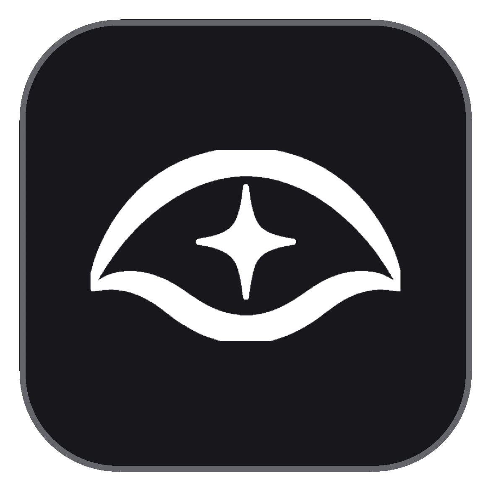
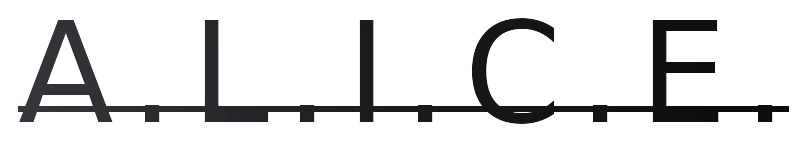

<a id="readme-top"></a>


<p align="center">
  &nbsp;
  &nbsp;
  &nbsp;
  &nbsp;
</p>

<br>

<div align="center">
  
  <h3 align="center">A.L.I.C.E. Frontend</h3>
  <p align="center">
    Frontend web (Next.js) del asistente LLM A.L.I.C.E. — chat, tema claro/oscuro y splash de carga.
    <br>
    <a href="https://github.com/hexed-AAL1X/A.L.I.C.E-front"><strong>Explorar repositorio »</strong></a>
    <br><br>
    <a href="https://github.com/hexed-AAL1X/A.L.I.C.E-front">Ver código</a>
    ·
    <a href="https://github.com/hexed-AAL1X/A.L.I.C.E-front/issues/new?labels=bug">Reportar bug</a>
    ·
    <a href="https://github.com/hexed-AAL1X/A.L.I.C.E-front/issues/new?labels=enhancement">Pedir feature</a>
  </p>
</div>

<details>
  <summary>Tabla de contenidos</summary>
  <ol>
    <li><a href="#about-the-project">About the project</a></li>
    <li><a href="#built-with">Built with</a></li>
    <li><a href="#important-notices">Important notices</a></li>
    <li>
      <a href="#getting-started">Getting started</a>
      <ul>
        <li><a href="#prerequisites">Prerequisites</a></li>
        <li><a href="#installation">Installation</a></li>
        <li><a href="#available-scripts">Available scripts</a></li>
      </ul>
    </li>
    <li><a href="#environments">Environments</a></li>
    <li><a href="#deployment">Deployment</a></li>
    <li>
      <a href="#contributing">Contributing</a>
      <ul>
        <li><a href="#top-contributors">Top contributors</a></li>
      </ul>
    </li>
    <li><a href="#contact">Contact</a></li>
  </ol>
</details>
<br>

<a id="about-the-project"></a>***About the project***


<p align="center">
  
</p>

**A.L.I.C.E.** (frontend) es la interfaz de chat del asistente LLM.

Incluye:

- Chat con streaming hacia el backend Flask.
- Sidebar de conversaciones, tema claro/oscuro y wordmark metálico.
- Splash de carga sincronizado con el health/warmup del backend.
- Micrófono del navegador + TTS del cliente (sin STT/TTS en el server).

<p align="right">(<a href="#readme-top">back to top</a>)</p>

<a id="built-with"></a>***Built with***


- 
- 
- 
- 
- 
- 

<p align="right">(<a href="#readme-top">back to top</a>)</p>

<a id="important-notices"></a>***Important notices***


> [!NOTE]
> No necesitas instalar nada global aparte de Node.js.
>
> Usa `npm run dev` para levantar el servidor local.

> [!IMPORTANT]
> Este repo es el **frontend**. Para chatear necesitas el backend de A.L.I.C.E. corriendo y configurar `NEXT_PUBLIC_API_URL` en `.env.local`.

<p align="right">(<a href="#readme-top">back to top</a>)</p>

<a id="getting-started"></a>***Getting started***


<a id="prerequisites"></a>

### Prerequisites

- Node.js (recomendado: LTS)
- npm
- Backend A.L.I.C.E. en `http://localhost:5000` (o la URL que configures)

<a id="installation"></a>

### Installation

1) Clonar el repositorio

```bash
git clone https://github.com/hexed-AAL1X/A.L.I.C.E-front.git
cd A.L.I.C.E-front
```

2) Instalar dependencias

```bash
npm install
```

3) Configurar entorno

```bash
cp .env.local.example .env.local
# o crea .env.local con:
# NEXT_PUBLIC_API_URL=http://localhost:5000
```

4) Ejecutar en modo desarrollo

```bash
npm run dev
```

5) Abrir en el navegador

- `http://localhost:3000/`

<a id="available-scripts"></a>

### Available scripts

```bash
npm run dev      # next dev
npm run build    # build producción
npm run start    # next start
npm run lint     # eslint
```

<p align="right">(<a href="#readme-top">back to top</a>)</p>

<a id="environments"></a>***Environments***


Variables en `.env.local` (Next.js):

| Variable | Descripción | Default |
| --- | --- | --- |
| `NEXT_PUBLIC_API_URL` | URL base del backend Flask | `http://localhost:5000` |

El front llama, entre otros, a `/api/health`, `/api/warmup` y `/api/chat/stream`.

<p align="right">(<a href="#readme-top">back to top</a>)</p>

<a id="deployment"></a>***Deployment***


### Render (Web Service)

- **Root directory:** `frontend` (si el monorepo incluye más carpetas) o la raíz de este repo
- **Build command:**

```bash
npm ci && npm run build
```

- **Start command:**

```bash
npm run start -- -p $PORT
```

- **Env:**

```bash
NEXT_PUBLIC_API_URL=https://TU-BACKEND.onrender.com
```

> [!NOTE]
> En el free tier de Render el servicio duerme tras inactividad; el splash del front espera a `/api/health`.

<p align="right">(<a href="#readme-top">back to top</a>)</p>

<a id="contributing"></a>***Contributing***


Contribuciones bienvenidas.

1) Fork del proyecto  
2) Crear una rama (`git checkout -b feature/nueva-feature`)  
3) Commit (`git commit -m "Add: ..."`)  
4) Push (`git push origin feature/nueva-feature`)  
5) Pull Request

<a id="top-contributors"></a>

### Top contributors

<div align="center">

<table>
  <tr>
    <td align="center" width="160">
      <a href="https://github.com/ShoterBroXD">
        <br />
        <b>Diego Melendez</b><br />
        <sub>@ShoterBroXD</sub>
      </a>
    </td>
    <td align="center" width="160">
      <a href="https://github.com/SebasTM502">
        <br />
        <b>SebasTM502</b><br />
        <sub>@SebasTM502</sub>
      </a>
    </td>
  </tr>
</table>

</div>

<p align="right">(<a href="#readme-top">back to top</a>)</p>

<a id="contact"></a>***Contact***


<p align="center">
  <a href="mailto:hexed_aal1x.ops@proton.me"></a>
  <a href="https://www.instagram.com/hexed_aal1x"></a>
  <a href="https://www.linkedin.com/in/leonardo-bravo-4120b8228/"></a>
</p>

<p align="right">(<a href="#readme-top">back to top</a>)</p>
